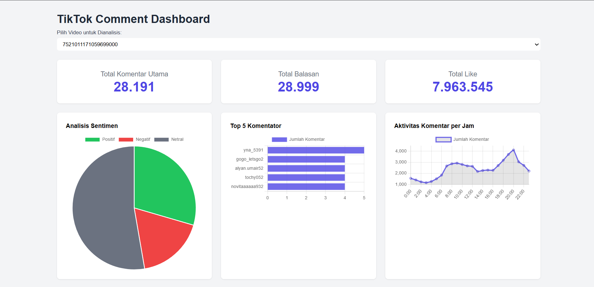
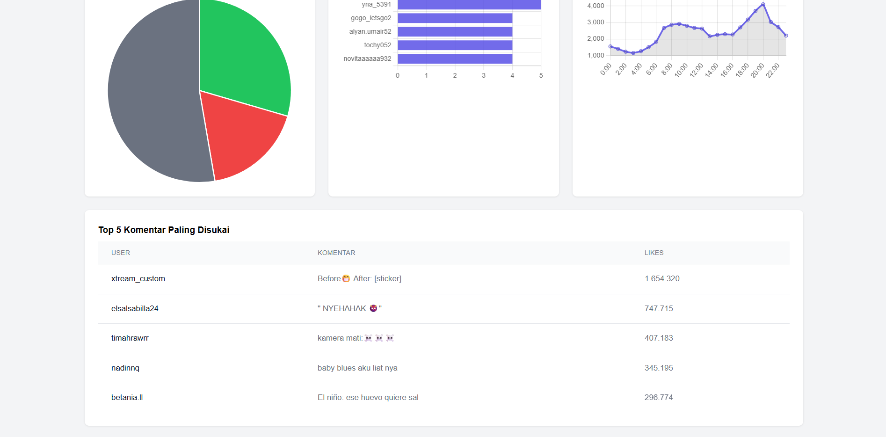

# Dashboard Analisis Komentar TikTok 📈



Proyek ini adalah sebuah aplikasi web yang dibuat dengan **Python** dan **Flask** untuk menganalisis dan memvisualisasikan data komentar dari video TikTok. Dashboard ini mengambil data mentah dari file `.csv` yang dihasilkan oleh scraper, lalu mengubahnya menjadi wawasan yang mudah dipahami melalui statistik dan grafik interaktif.

---

## 📝 Fitur Utama

-   **Statistik Komprehensif**: Lihat ringkasan data penting seperti total komentar utama, total balasan, dan total *like* di semua komentar.
-   **Analisis Sentimen**: Secara otomatis mengklasifikasikan komentar menjadi **Positif**, **Negatif**, atau **Netral** dan menampilkannya dalam bentuk *pie chart*.
-   **Visualisasi Data**:
    -   Grafik batang untuk menampilkan **Top 5 komentator** dengan aktivitas terbanyak.
    -   Grafik garis untuk melihat **puncak aktivitas komentar** berdasarkan jam.
-   **Tabel Interaktif**: Lihat daftar **Top 5 komentar** dengan jumlah *like* terbanyak.
-   **Pemilih Video Dinamis**: Mudah beralih antara analisis untuk file `.csv` yang berbeda melalui menu *dropdown*.

---

## 📸 Screenshot Proyek

Berikut adalah beberapa tampilan dari dashboard aplikasi:

**Tampilan grafik**


**Detail tabel**


---

## 👨‍💻Teknologi yang Digunakan

-   **Backend**:
    -   **Python 3.10+**
    -   **Flask**: *Framework* web untuk membuat server dan API.
    -   **Pandas**: Untuk membaca dan menganalisis data dari file `.csv`.
    -   **VADER Sentiment**: Untuk analisis sentimen pada teks komentar.
-   **Frontend**:
    -   **HTML5** & **Tailwind CSS**: Untuk struktur dan styling halaman.
    -   **JavaScript (Fetch API)**: Untuk mengambil data secara asinkron dari backend.
    -   **Chart.js**: Untuk membuat grafik dan chart yang interaktif dan responsif.
-   **Scraper Pendukung**:
    -   **Click**: Untuk membuat *Command-Line Interface* (CLI) yang mudah digunakan.
    -   **Requests**: Untuk melakukan permintaan HTTP ke API TikTok.
    -   **Loguru**: Untuk *logging* yang lebih baik dan informatif.

---

## 🧷 Instalasi & Setup

Ikuti langkah-langkah ini untuk menjalankan proyek di komputer Anda.

**1. Clone Repositori**
```
git clone https://github.com/harysaputra3/tiktok-comment.git

cd nama-proyek
```

**2. Siapkan Environment & Install Dependencies**
Disarankan untuk menggunakan *virtual environment*.

### Buat virtual environment
```
python -m venv venv
```
### Aktifkan (Windows)
```
.\venv\Scripts\activate
```
### Aktifkan (macOS/Linux)
```
source venv/bin/activate
```
#### Buat file bernama `requirements.txt` di folder utama proyek, lalu salin dan tempel semua teks di bawah ini ke dalamnya:
```
Flask
pandas
vaderSentiment
click
requests
loguru
jmespath
```
#### Setelah file dibuat, install semua library dengan satu perintah:
```
pip install -r requirements.txt
```

**3. Siapkan Struktur Folder & Data**
Pastikan struktur folder proyek Anda seperti ini dan letakkan file `.csv` hasil scraper di dalam folder `data/`.
```
/tiktok-comment
├── data/
│   └── 7165315573359643905.csv
│   └── 7165315573359643905.json
├── ss/
│   ├── ss1.png
│   └── ss2.png
├── templates/
│   └── index.html
├── tiktokcomment/
│   ├── __init__.py
│   ├── tiktokcomment.py
│   └── typing.py
├── main.py
├── app.py
├── README.md
└── requirements.txt
```

---

## 🖥️Cara Menjalankan

Proyek ini memiliki dua bagian: **scraper** (untuk mendapatkan data) dan **dashboard** (untuk menampilkan data).

**1. Jalankan Scraper (main.py)**
Untuk mengumpulkan data komentar, jalankan `main.py` dari terminal dengan memberikan ID video.

```
python main.py --tiktok <ID_VIDEO_DISINI>
```

Contoh:
```
python main.py --tiktok 7165315573359643905
```
Ini akan menghasilkan file `.csv` dan `.json` di dalam folder `data/`.

**2. Jalankan Server Dashboard (app.py)**
Setelah Anda memiliki setidaknya satu file `.csv` di folder `data/`, jalankan server Flask.
```
python app.py
```

**3. Buka Dashboard**
Buka browser Anda dan akses alamat berikut:
```
http://127.0.0.1:5000
```
Pilih file dari *dropdown* untuk melihat hasil analisisnya.

---

## Rencana Pengembangan Selanjutnya

-   [ ] Menambahkan fitur **Word Cloud** untuk melihat kata-kata yang paling sering digunakan.
-   [ ] Menambahkan fungsionalitas **pencarian komentar** berdasarkan kata kunci.
-   [ ] Membuat tombol **"Download Laporan PDF"**.
-   [ ] Mengganti penyimpanan dari file CSV menjadi database **MYSQL** untuk performa yang lebih baik.